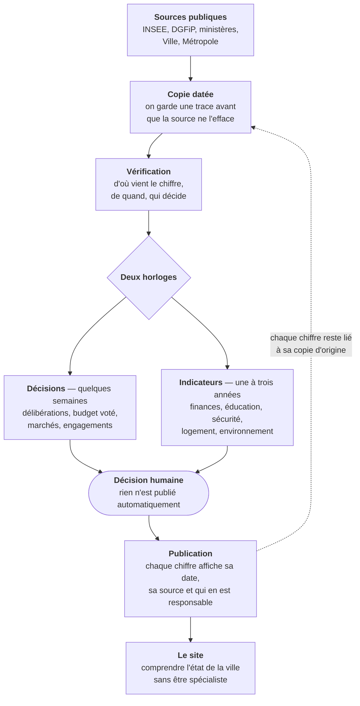

# Observatoire de Clermont-Ferrand

**Statut :** Espace de travail public, en construction
**Responsable :** Cinthia Coelho
**Dernière vérification :** 2026-08-19

Comment va Clermont-Ferrand ? Qui décide quoi ? Qu'est-ce qui a été promis, voté,
financé, fait ?

Ce dépôt contient le travail préparatoire d'un observatoire citoyen : **quelles données
publiques existent sur le territoire clermontois, ce qu'elles disent vraiment, et à quelles
conditions on peut les lire sans les faire mentir.**

Il accompagne le mandat municipal **2026-2032** et couvre **Clermont-Ferrand**
(INSEE 63113) **et Clermont Auvergne Métropole** — parce qu'une large part de ce qui
concerne la ville se décide à l'échelle métropolitaine.

## Ce que l'observatoire veut être

**Une vitrine de l'état de santé de la ville**, lisible par tout le monde, où le suivi des
engagements de campagne est une couche parmi d'autres — pas le sujet principal.

Ce que l'observatoire ne veut pas devenir : un entrepôt d'arrêtés, d'ordonnances et de
délibérations que personne ne lit. Le document administratif est la **preuve**, jamais le
produit.

> **Engagement de langue.** Un observatoire que seuls des spécialistes comprennent a
> échoué, quelle que soit la qualité de ses données. Les documents de ce dépôt sont des
> documents de travail et emploient un vocabulaire technique ; **le site, lui, doit être
> compris par quelqu'un qui n'a jamais ouvert un budget communal.** Toute notion technique
> qui sort d'ici doit être traduite avant d'être publiée.

## La chaîne de travail

**Pourquoi deux horloges.** Les décisions sont publiées en quelques jours ; leurs effets
se mesurent des années plus tard. Les mélanger sur un même axe de temps donne des
graphiques faux. Conséquence concrète : **aucune évaluation statistique du mandat en cours
n'est possible avant mi-2028** — le détail est en [11](docs/11_LATENCE_ET_DEUX_HORLOGES.md).

**Pourquoi la copie datée.** Environ 70 % des jeux de données ouverts locaux écrasent leur
propre historique. Personne à Clermont-Ferrand ne conserve ce passé — ni la collectivité,
ni la presse, ni l'opposition. Voir [14](docs/14_VOLATILITE_DES_SOURCES.md).

## Les règles qui tiennent le projet

1. **Une donnée sans date de référence et sans date de publication n'est pas une donnée.**
2. **Un chiffre sans indication de qui décide est une imputation, pas une information.**
3. **Aucune courbe ne traverse une rupture méthodologique sans la signaler.**
4. **L'absence de preuve n'est pas la preuve d'une absence.** Les manques sont
   enregistrés, jamais comblés par déduction.
5. **Ce qui n'est pas archivé est perdu.**
6. **Cet observatoire documente l'action publique.** Il ne fait pas campagne, ne classe pas
   les élus, ne prescrit pas de choix politique, et ne présente jamais une corrélation
   comme une cause.

## Carte des documents

| Document | Objet |
|---|---|
| [00_PERIMETRE](docs/00_PERIMETRE.md) | Ce que le projet couvre et ce qu'il exclut |
| [10_INVENTAIRE_DES_SOURCES](docs/10_INVENTAIRE_DES_SOURCES.md) | 61 indicateurs vérifiés : producteur, profondeur, délai, licence |
| [11_LATENCE_ET_DEUX_HORLOGES](docs/11_LATENCE_ET_DEUX_HORLOGES.md) | Combien de temps sépare un fait de sa publication |
| [12_RUPTURES_DE_SERIE](docs/12_RUPTURES_DE_SERIE.md) | Les dates où une comparaison devient fausse |
| [13_SPHERES_DE_COMPETENCE](docs/13_SPHERES_DE_COMPETENCE.md) | Qui décide quoi : Ville, Métropole, Département, Région, État |
| [14_VOLATILITE_DES_SOURCES](docs/14_VOLATILITE_DES_SOURCES.md) | Ce que l'on perd chaque jour sans copie datée |
| [15_SOURCES_DES_DECISIONS_MUNICIPALES](docs/15_SOURCES_DES_DECISIONS_MUNICIPALES.md) | Accéder aux délibérations : délais et cadre juridique |
| [16_TERRITOIRES_DE_COMPARAISON](docs/16_TERRITOIRES_DE_COMPARAISON.md) | Comparer Clermont à des villes semblables |
| [17_REGISTRE_DES_LACUNES](docs/17_REGISTRE_DES_LACUNES.md) | Ce qui manque, ce qui a été demandé, et la réponse obtenue |
| [18_CHANTIERS](docs/18_CHANTIERS.md) | Les six travaux de fond à mener |
| [99_INDEX](docs/99_INDEX.md) | Index, décisions prises, questions ouvertes |
| [AGENTS](AGENTS.md) | Contrat de travail entre les agents automatisés |
| [data/sources.csv](data/sources.csv) | L'inventaire en format structuré |

## Ce dépôt n'est pas

- **un site web** — il contient la connaissance nécessaire pour en construire un ;
- **un entrepôt de données** — aucune valeur acquise auprès d'un producteur public n'y est
  stockée ;
- **une évaluation du mandat** — c'est matériellement impossible avant mi-2028 ;
- **une autorisation de collecte** — décrire une source ne veut pas dire aller la chercher.

## Espace de travail public

Ce dépôt est public dès le premier jour, volontairement : la valeur d'une ligne de base
tient à ce qu'elle ait été publiée **avant** que quiconque ait intérêt à son contenu.

En conséquence, on y trouve du travail en cours. **Un document en brouillon n'est pas une
position de l'observatoire**, et un élément marqué « à vérifier » ne l'est vraiment pas.
Les corrections sont bienvenues : ouvrez une issue.

## Licence

Documentation originale : **CC BY 4.0** — voir [LICENSE.md](LICENSE.md).
Les données publiques citées conservent les droits de leurs producteurs, indiqués source
par source dans l'inventaire.

## État actuel

Relevé initial effectué le 18 août 2026 par consultation directe des pages de chaque
producteur. Aucune donnée n'a été collectée. Aucune copie datée n'est encore en place —
c'est le premier chantier ([18](docs/18_CHANTIERS.md)).

Trois vérifications conditionnent la suite et sont ouvertes en issues : la date réelle du
jeu de données des délibérations, la présence d'une ventilation par domaine dans les
comptes de la commune, et l'énumération complète du catalogue open data local.
